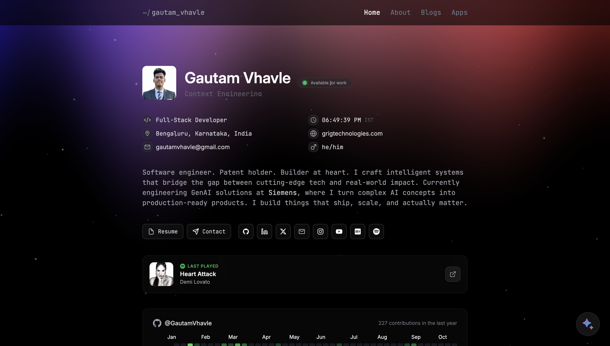

<div align="center">

# ⚡ Gautam Vhavle — Portfolio

**A minimal, modern developer portfolio built for speed and aesthetics.**

[](https://gautamvhavle.vercel.app)
[](https://linkedin.com/in/gautamvhavle)
[](https://dev.to/gautamvhavle)



</div>

---

## ✨ Features

| Feature | Description |
|---------|-------------|
| 🌙 **Dark Theme** | Sleek glassmorphism design with smooth gradients |
| 📱 **Responsive** | Pixel-perfect on all devices |
| 📝 **Dynamic Blog** | Auto-fetched articles from DEV.to API |
| 🏅 **Certifications** | Expandable list with 36+ credentials |
| 🎵 **Spotify Vibes** | Embedded playlist integration |
| ⚡ **Fast** | Optimized with Vite for instant HMR |
| 🎨 **Animations** | Smooth transitions & micro-interactions |

---

## 🚀 Quick Start

```bash
# Clone
git clone https://github.com/GautamVhavle/portfoliov2.git
cd portfoliov2

# Install & Run
npm install && npm run dev
```

> Open **[localhost:5173](http://localhost:5173)** — that's it!

---

## 🛠 Tech Stack

<div align="center">


</div>

---

## 📁 Project Structure

```
portfoliov2/
├── public/
│   └── assets/          # Images, icons, tech stack logos
├── src/
│   ├── components/      # Reusable UI components
│   ├── pages/           # Route pages
│   │   ├── Home/        # Landing page sections
│   │   ├── About/       # About me page
│   │   ├── Apps/        # Projects showcase
│   │   └── Blogs/       # DEV.to integration
│   ├── content/         # JSON data (certificates, etc.)
│   └── styles/          # Global CSS
└── README.md
```

---

## 📜 Scripts

| Command | Description |
|---------|-------------|
| `npm run dev` | Start development server |
| `npm run build` | Build for production |
| `npm run preview` | Preview production build |
| `npm run lint` | Run ESLint |

---

## 🤝 Contributing

Contributions, issues, and feature requests are welcome!

1. Fork the repo
2. Create your branch (`git checkout -b feature/amazing`)
3. Commit changes (`git commit -m 'Add amazing feature'`)
4. Push (`git push origin feature/amazing`)
5. Open a Pull Request

---

## 📝 License

```
MIT © 2025 Gautam Vhavle
```

---

<div align="center">

**Built with ☕ and code by [Gautam Vhavle](https://github.com/GautamVhavle)**

⭐ Star this repo if you like it!

</div>